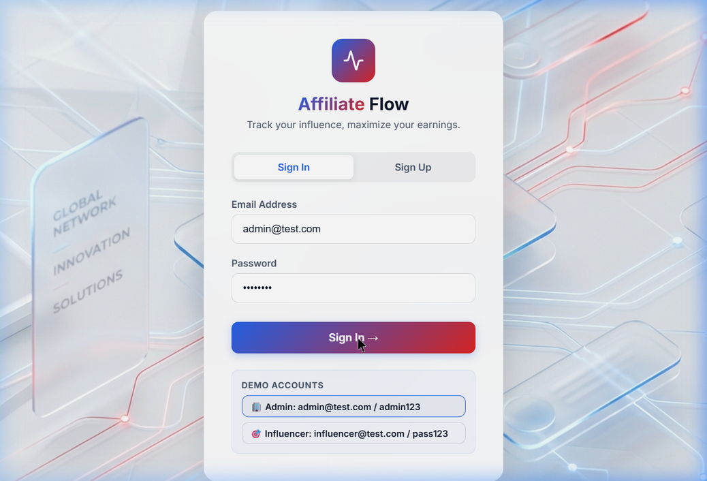
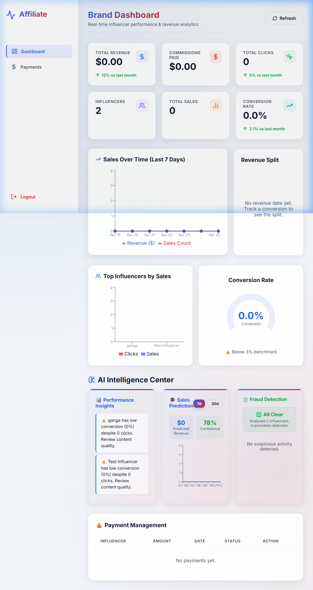
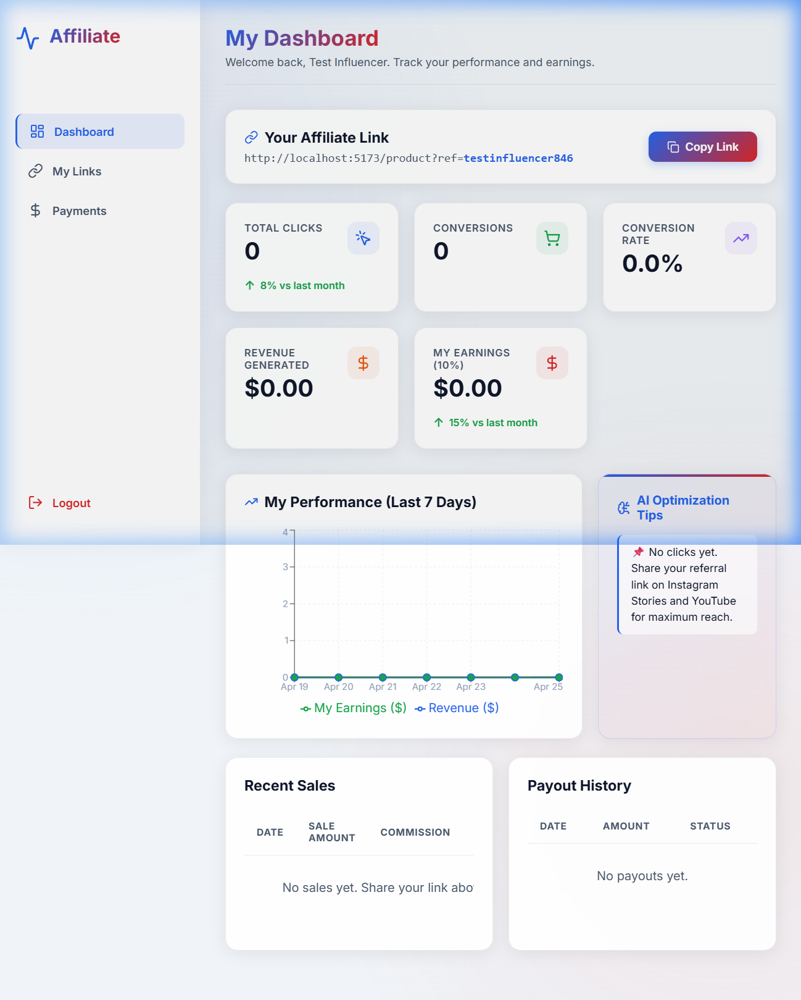

# 🚀 Influencer Affiliate Sales & Payment Tracking Platform

> **AI Full-Stack Assignment** | Built with React + Node.js + Prisma + SQLite

A professional web-based dashboard platform that tracks influencer-driven sales, payment status, and performance analytics with AI-powered insights.

---

## 📸 Screenshots

### 🔐 Login Page


### 🏢 Admin (Brand) Dashboard


### 🎯 Influencer Dashboard


---

## 🔗 Links

| Resource | URL |
|----------|-----|
| 📁 GitHub Repository | https://github.com/ganga061/AI-fullstack |
| 🌐 Live Demo | https://ai-fullstack-frontend.vercel.app *(see deploy guide below)* |
| 📹 Demo Video | *(record using OBS or Loom — see guide below)* |

---

## 🧩 Features

### 👤 User Roles
- **Admin (Brand)** — Full analytics, payment approvals, AI intelligence center
- **Influencer** — Personal dashboard, referral link, earnings tracking

### 🔗 Affiliate Tracking
- Unique referral link per influencer (e.g., `?ref=rahul123`)
- Click tracking + Conversion tracking
- Real-time revenue and commission calculation (10%)

### 💰 Payment Management
- Auto-create PENDING payment on every sale
- Admin approves payments → status becomes PAID
- Full payout history per influencer

### 📊 Visual Dashboard (4 Charts)
| Chart | Type | Data |
|-------|------|------|
| Sales Over Time | Line Chart | 7-day revenue & sales count |
| Top Influencers | Bar Chart | Sales vs Clicks comparison |
| Revenue Split | Pie Chart | Revenue % per influencer |
| Conversion Rate | Gauge Chart | Live % with 3% benchmark |

### 🤖 AI Features (3 Modules)
| Feature | Description |
|---------|-------------|
| **Sales Prediction** | Predicts next 7/30 days revenue using trend analysis + weekend multipliers |
| **Performance Insights** | AI-generated tips: "Low conversion despite high clicks", "Top performer bonus recommendation" |
| **Fraud Detection** | Detects bot traffic (click bursts), abnormal conversion rates, suspicious activity |

### ✨ UX Animations
- Ripple effect on all buttons
- Hover lift on stat cards with icon spin
- Fade-in slide animation for AI insights
- Pulse loading indicators

---

## 🏗️ Architecture

```
AI full-stack/
├── frontend/                   # React + TypeScript (Vite)
│   ├── src/
│   │   ├── pages/
│   │   │   ├── Login.tsx           # Auth (Sign In / Sign Up)
│   │   │   ├── AdminDashboard.tsx  # Brand analytics + AI center
│   │   │   ├── InfluencerDashboard.tsx  # Influencer stats + payouts
│   │   │   └── ProductTrackingSimulation.tsx  # Demo product page
│   │   ├── components/
│   │   │   ├── Sidebar.tsx         # Navigation sidebar
│   │   │   └── StatCard.tsx        # Metric card component
│   │   └── index.css               # Design system (glassmorphism)
│   └── public/bg.png               # Landing background image
│
├── backend/                    # Node.js + Express
│   ├── server.js               # All API routes + AI endpoints
│   ├── prisma/
│   │   └── schema.prisma       # Database schema (5 models)
│   └── package.json
│
├── START.bat                   # One-click launcher (Windows)
└── README.md
```

### Database Schema (Prisma + SQLite)
```prisma
User        → id, name, email, passwordHash, role (ADMIN/INFLUENCER)
Influencer  → userId, referralCode, commissionRate (10%)
Click       → influencerId, ipAddress, timestamp
Sale        → influencerId, amount, commissionEarned, status, date
Payment     → influencerId, amount, status (PENDING/PAID), date
```

---

## 🛠️ Tech Stack

| Layer | Technology |
|-------|-----------|
| Frontend Framework | React 18 + TypeScript |
| Build Tool | Vite |
| Styling | Vanilla CSS (Glassmorphism design system) |
| Charts | Recharts |
| Icons | Lucide React |
| Backend | Node.js + Express |
| ORM | Prisma v5 |
| Database | SQLite (dev.db) |
| Auth | JWT (jsonwebtoken) |
| Password | bcrypt |

---

## ⚡ Quick Start

### Option 1: One-Click (Windows)
```
Double-click START.bat
```

### Option 2: Manual

**Backend** (Terminal 1):
```bash
cd backend
node server.js
```
> ✅ Server running on http://localhost:5000

**Frontend** (Terminal 2):
```bash
cd frontend
npm run dev
```
> ✅ App running on http://localhost:5173

### First-time setup (only once):
```bash
cd backend
npm install
npx prisma db push
```
```bash
cd frontend
npm install
```

---

## 🔑 Test Accounts

| Role | Email | Password |
|------|-------|----------|
| 🏢 Admin (Brand) | admin@test.com | admin123 |
| 🎯 Influencer | influencer@test.com | pass123 |

---

## 🎬 Demo Flow

1. **Login as Influencer** → copy your referral link
2. **Open link in browser** → click "Buy Now" on product page (registers a sale)
3. **Login as Admin** → see sale on dashboard, approve payment
4. **Switch back to Influencer** → payout shows as PAID, AI insights update

---

## 🌐 API Endpoints

| Method | Endpoint | Description |
|--------|----------|-------------|
| POST | `/api/auth/register` | Create account |
| POST | `/api/auth/login` | Login → returns JWT |
| GET | `/api/tracking/:referralCode` | Track a click |
| POST | `/api/tracking/conversion` | Record a sale |
| GET | `/api/dashboard/admin` | Admin metrics + charts data |
| GET | `/api/dashboard/influencer` | Influencer metrics |
| GET | `/api/payments` | List all payments |
| PUT | `/api/payments/:id/approve` | Admin approves payment |
| GET | `/api/ai/insights` | AI performance insights |
| GET | `/api/ai/predict` | 7/30-day sales prediction |
| GET | `/api/ai/fraud` | Fraud detection scan |

---

## 📹 Recording a Demo Video (5–10 mins)

Use **OBS Studio** (free) or **Loom** (browser):

**Script:**
1. `(0:00)` Show project folder + `START.bat`
2. `(0:30)` Open browser → Login page → explain the design
3. `(1:00)` Register a new influencer account
4. `(2:00)` Login as Influencer → show dashboard, copy referral link
5. `(3:00)` Open referral link → click "Buy Now" to simulate a sale
6. `(4:00)` Login as Admin → show all 4 charts populated
7. `(6:00)` Show AI Intelligence Center (Insights, Prediction, Fraud Detection)
8. `(7:30)` Approve a payment → show status change
9. `(8:30)` Switch back to Influencer → show PAID status
10. `(9:30)` Show GitHub repo + code structure

---

## 📁 Google Drive Submission Checklist

Upload the following to your Google Drive folder and make it **publicly accessible**:

- [ ] `project.zip` — Full project source code (zip of `AI full-stack/` folder)
- [ ] `demo_video.mp4` — 5–10 minute screen recording
- [ ] `README.md` — This file (also in GitHub repo)
- [ ] `screenshots/` folder — Login, Admin Dashboard, Influencer Dashboard

**Make folder public:**
> Google Drive → Right-click folder → Share → Change to "Anyone with the link" → Copy link → Submit

---

## 👨‍💻 Author

Built for: AI Full-Stack Assignment  
Platform: Influencer Affiliate Sales & Payment Tracking  
Stack: React + Node.js + Prisma + SQLite + AI Features
